# ☁️ Deploying a Node.js App on AWS EC2 with NGINX

> The full pipeline: provision → secure → deploy → keep alive → reverse proxy.


---

## 🎯 Objective

Deploy a Node.js application to an AWS EC2 instance, keep it running as a managed background process with PM2, and serve it on port 80 behind an NGINX reverse proxy.

## 🧰 Tools

- AWS account (EC2 permissions)
- Create Key pair for SSH
- Create VPC with appropriate subnetting
- Create Security group with inbound rules
- Ubuntu Server on EC2 (`t3.micro`)
- SSH client, Git, Node.js, PM2, NGINX

---

## 🏗️ Architecture

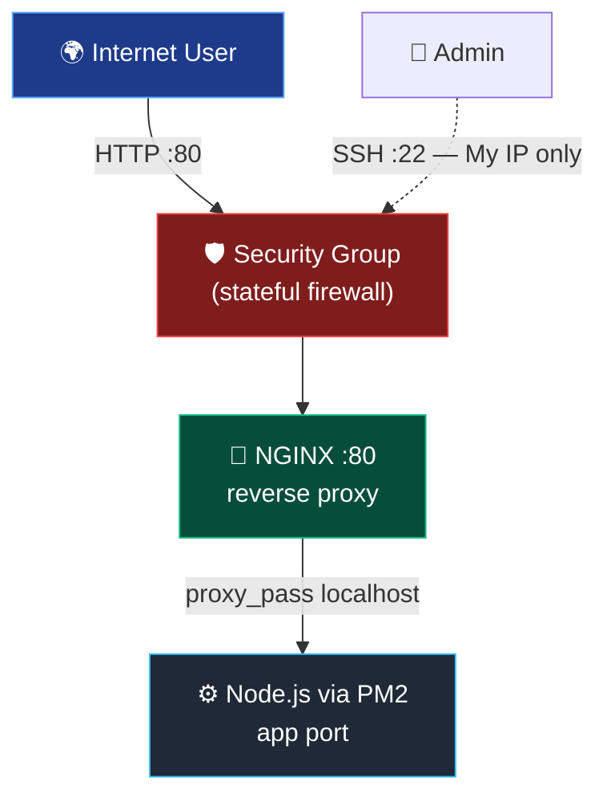

---

## Deployment, Step by Step

### 2. Create VPC
First, go to the VPC dashboard page (search "VPC" from the AWS console home page) and select **Create VPC**.

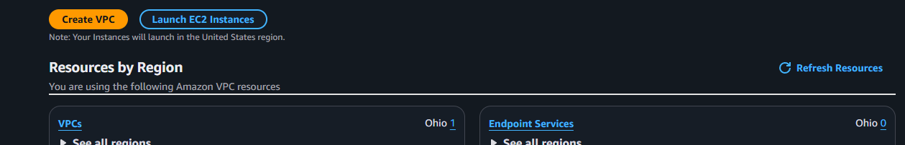

In the Create VPC page:

- Under **VPC settings**, select **"VPC and more"** — this auto-creates the subnets, route tables, and internet gateway for you.
- In **Name tag auto-generation**, give an appropriate name (e.g. `wc2026`). This prefix is applied to every resource it creates.
- **IPv4 CIDR block:** leave the default `10.0.0.0/16`.
- **IPv6 CIDR block:** No IPv6 CIDR block.
- **Tenancy:** Default.

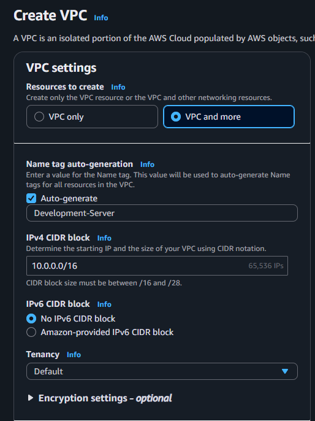

- **Number of Availability Zones (AZs):** `1` is enough for a single-instance deployment (choose `2` if you want high availability).
- **Number of public subnets:** `2`.
- **Number of private subnets:** `2` (this app is internet-facing through NGINX, so we only need a public subnet).
- **NAT gateways:** None (they cost money and aren't needed here).
- **VPC endpoints:** None.
- Keep **Enable DNS hostnames** and **Enable DNS resolution** checked.

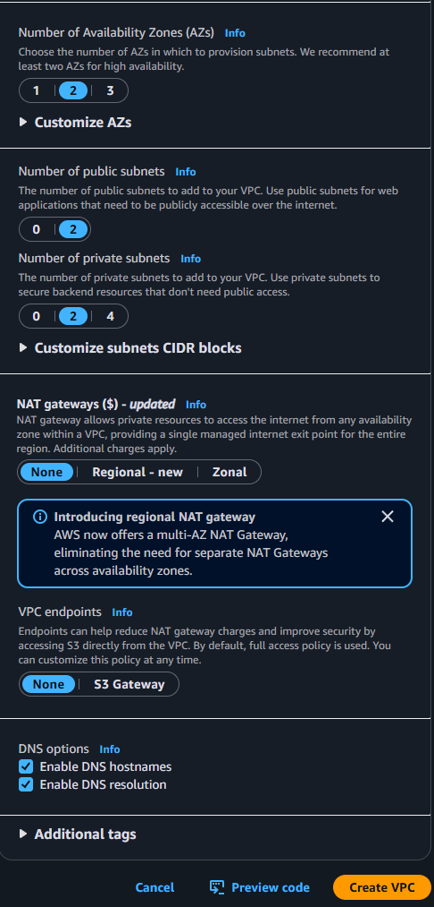

Review the **Preview** pane on the right — it shows the VPC, public subnet, route table, and internet gateway that will be created. Then click **Create VPC**.

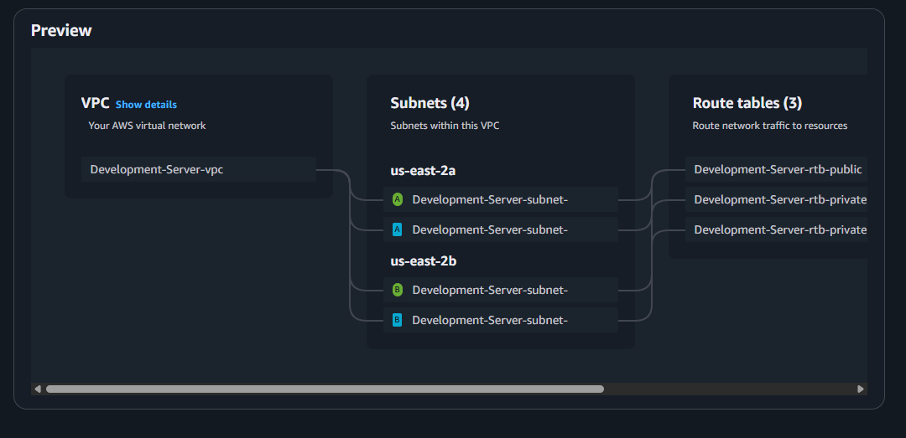


### 3. Create Security Group
From the EC2 dashboard, in the left panel click on **Security Groups**.

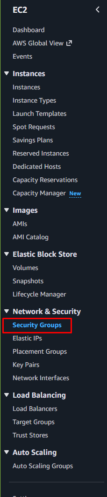

Then select **"Create security group"**.

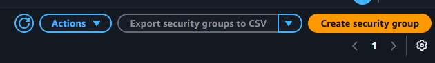

In the Create security group page:

- **Security group name:** give an appropriate name (e.g. `wc2026-sg`).
- **Description:** a short description (e.g. "Inbound web + SSH").
- **VPC:** select the VPC you created in the previous step.

Under **Inbound rules**, click **Add rule** for each of the following:

| Type  | Protocol | Port | Source        | Why |
|-------|----------|------|---------------|-----|
| SSH   | TCP      | 22   | **My IP**     | Admin access — limit to your own IP, not the world |
| HTTP  | TCP      | 80   | Anywhere-IPv4 | Public web traffic to NGINX |
| HTTPS | TCP      | 443  | Anywhere-IPv4 | Optional, for when you add TLS |

> Note: the application's own port (e.g. 3000) is **not** opened to the internet — NGINX listens on 80 and proxies inward, so the app stays private. This is least-privilege by design.

Leave the **Outbound rules** at their default (all traffic allowed), then click **Create security group**.


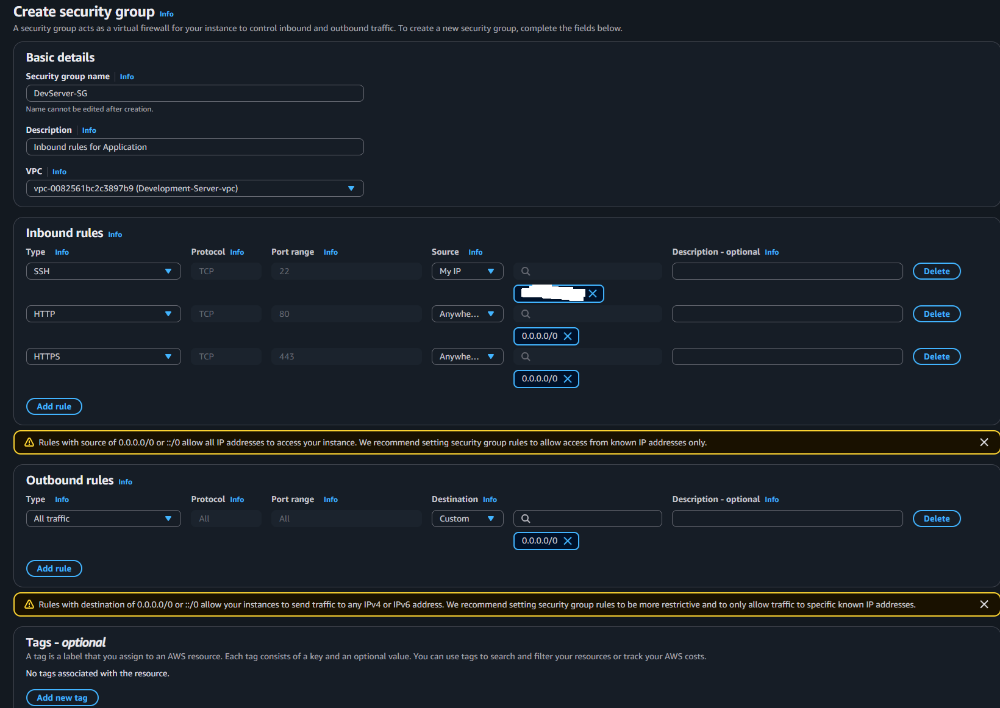

### 4. Launch the EC2 Instance
From the EC2 dashboard, go to **Instances → Launch instances**.

- **Name:** give the instance a name (e.g. `wc2026-server`).
- **Application and OS Image (AMI):** select **Ubuntu Server** (e.g. 24.04 LTS).
- **Instance type:** `t3.micro`.

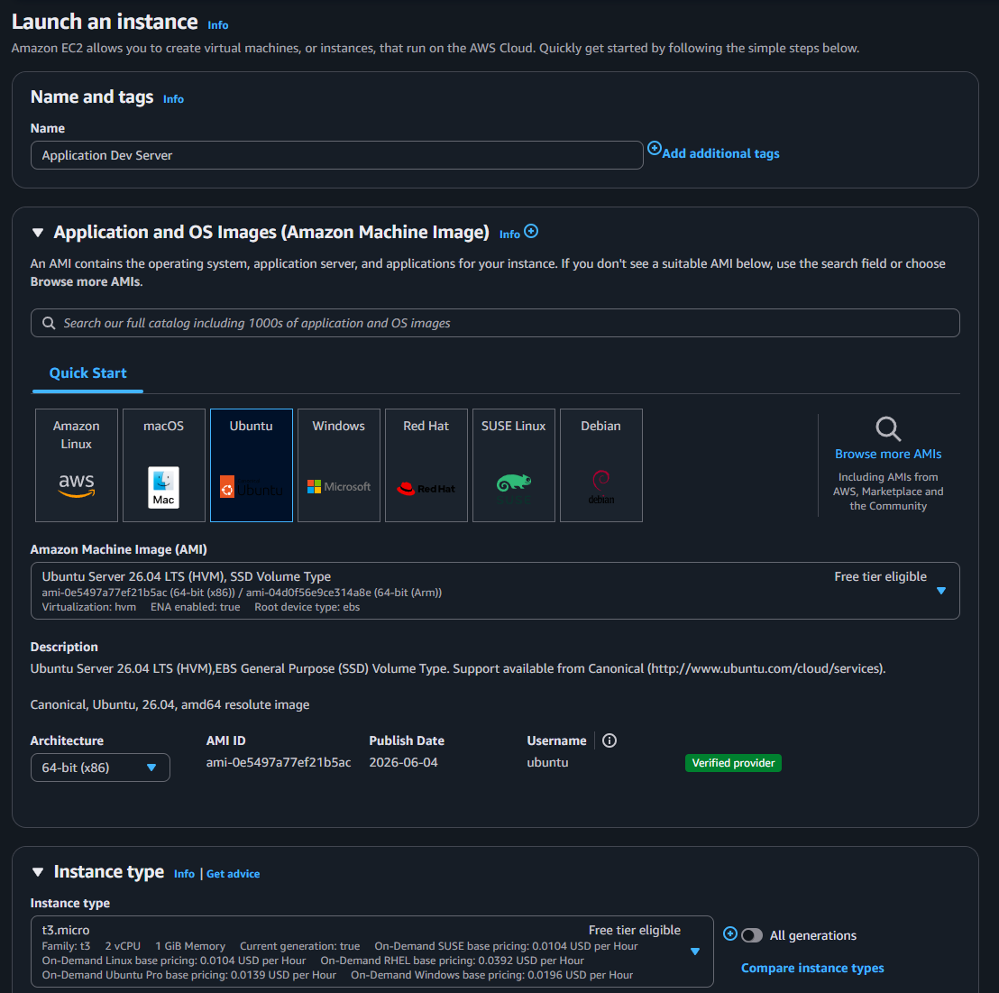

- **Key pair (login):** select the key pair you created in Step 1.
- Under **Network settings**, click **Edit** and set:
  - **VPC:** the VPC you created.
  - **Subnet:** the public subnet.
  - **Auto-assign public IP:** **Enable**.
  - **Firewall (security groups):** choose **Select existing security group** and pick the one you created.

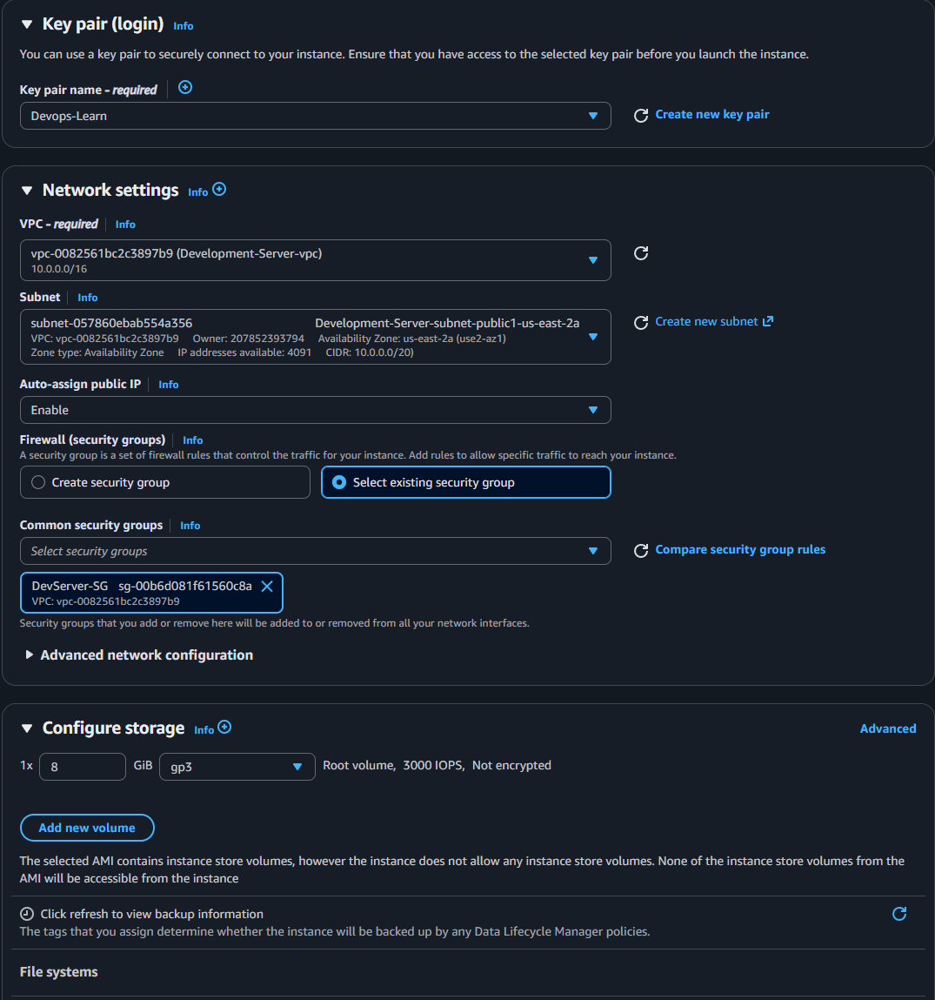

- **Configure storage:** the default `8 GiB gp3` is fine.
- Review the summary, then click **Launch instance**.

Once the instance state shows **Running**, copy its **Public IPv4 address** and connect over SSH:

```bash
ssh -i your-key.pem ubuntu@<public-ip>
```


### 3. Secure it with a security group (a stateful firewall)
| Rule | Port | Source |
|------|------|--------|
| SSH  | 22   | **My IP only** |
| HTTP | 80   | `0.0.0.0/0` |
| HTTPS| 443  | `0.0.0.0/0` |

> SSH is **never** left open to the world. Scope it to your own IP.

Once the instance state shows **Running**, copy its **Public IPv4 address** and connect over SSH:

```bash
ssh -i ~/.ssh/devops-lab-key.pem ubuntu@<public-ip>
```

### 5. Prepare the Server
Update the system and install Git and Node.js:
 
```bash
sudo apt update && sudo apt upgrade -y
sudo apt install -y git nodejs npm
node -v && npm -v          # confirm Node and npm are installed
```
 
> For a newer Node.js than Ubuntu's default, use NodeSource instead:
> `curl -fsSL https://deb.nodesource.com/setup_20.x | sudo -E bash - && sudo apt install -y nodejs`
 
### 6. Deploy the Application with PM2
Clone your app, install dependencies, and run it under PM2 so it survives reboots and crashes:
 
```bash
git clone https://github.com/Ahnafshariar/wc2026-tracker.git 
cd wc2026-tracker
npm install
 
sudo npm install -g pm2
pm2 start npm --name wc-app -- start     # or: pm2 start src/server.js --name wc-app
pm2 save
pm2 startup                              # run the command it prints, for boot persistence
 
# verify the app answers locally on its port (e.g. 3000)
curl http://localhost:3000
```

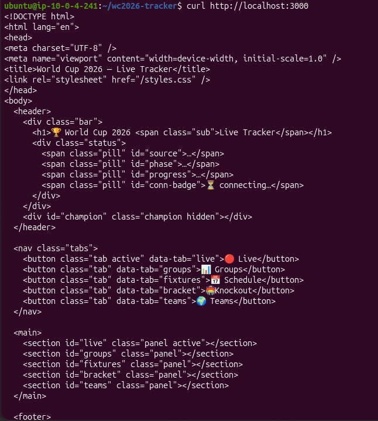
 
### 7. Install and Configure NGINX as a Reverse Proxy
Install NGINX and point it at your app's local port:
 
```bash
sudo apt install -y nginx
 
# remove the default site and create the reverse proxy
sudo rm -f /etc/nginx/sites-enabled/default
sudo nano /etc/nginx/sites-available/app
```
 
Paste this configuration (match the port to your app):
 
```nginx
server {
    listen 80;
    server_name _;
 
    location / {
        proxy_pass http://localhost:3000;     # your app's local port
        proxy_http_version 1.1;
        proxy_set_header Host               $host;
        proxy_set_header X-Real-IP          $remote_addr;
        proxy_set_header X-Forwarded-For    $proxy_add_x_forwarded_for;
        proxy_set_header X-Forwarded-Proto  $scheme;
    }
}
```
 
Enable the site, test the config, and reload:
 
```bash
sudo ln -s /etc/nginx/sites-available/app /etc/nginx/sites-enabled/app
sudo nginx -t                    # should say: syntax is ok / test is successful
sudo systemctl restart nginx
```
 
### 8. Verify
Open the instance's public IP in a browser — the app is now served on port 80 through NGINX:
 
```
http://<public-ip>
```

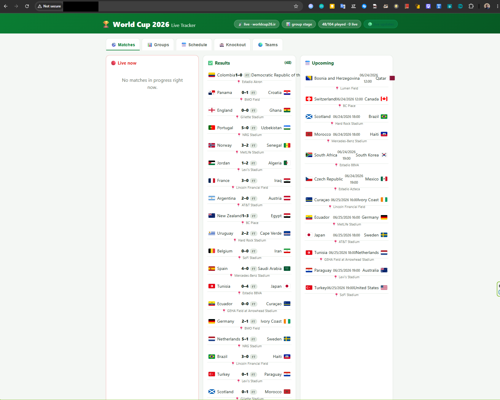

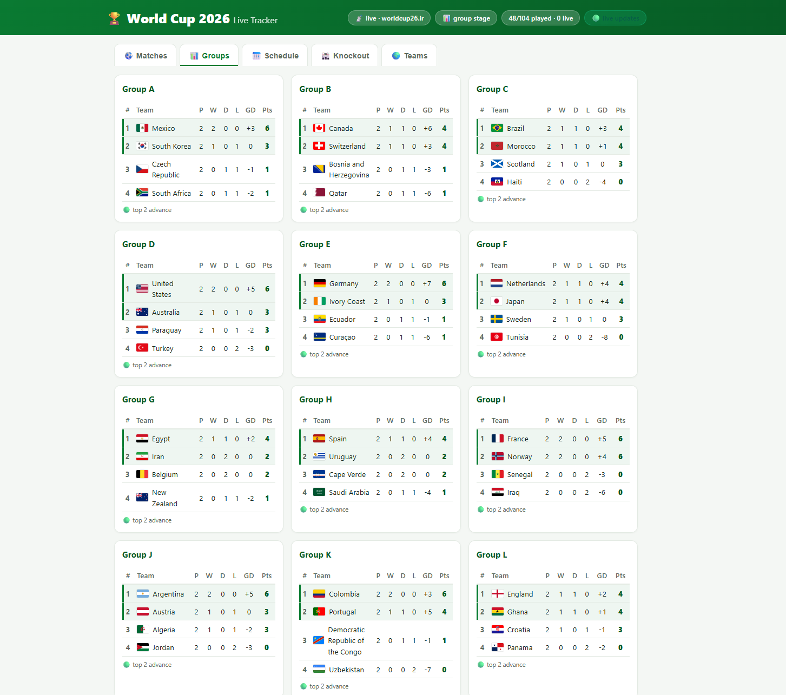


---
 
## 📚 What I Learnt
 
- **Security groups are stateful firewalls.** Restricting SSH to *My IP* while leaving only 80/443 open to the world is the core of least-privilege access.
- **The app port stays private.** NGINX on port 80 proxies inward to the app, so the Node.js process is never exposed directly to the internet.
- **PM2 makes the app durable.** It restarts the app on crash and on reboot, turning a foreground `npm start` into a managed service.
- **"VPC and more" bootstraps the network** — subnet, route table, and internet gateway in one step (the manual version of this is a great follow-up project).
---
 
## 🛡️ Security Strengths
 
- **SSH limited to a single IP** — no open `0.0.0.0/0` on port 22.
- **App not directly exposed** — only NGINX (port 80) is reachable; the app port is closed at the security group.
- **Reverse proxy as a boundary** — NGINX terminates public traffic and forwards it internally.
## ⚠️ Hardening To-Do
 
- **Add TLS (HTTPS).** Use Certbot/Let's Encrypt or an ACM certificate behind a load balancer — an open 443 without a certificate serves nothing.
- **Run the app as a non-root user** and enable a host firewall (`ufw`) as defense in depth.
- **Enable automatic security updates** (`unattended-upgrades`).
- **Redact before publishing** — scrub the account ID, key pair name, public IP, and instance ID from screenshots.
- **Remember "My IP" changes** — if SSH fails later (new network/Wi-Fi), update the inbound rule with your current IP.
---
 
## ✅ Outcome
 
A Node.js application running on an AWS EC2 instance, kept alive by PM2 and served publicly on port 80 through an NGINX reverse proxy — built on a properly scoped VPC, security group, and SSH key pair.
 
---
 
*Built by Md Ahnaf Shariar · Toronto, ON · Security · Networking · DevOps*